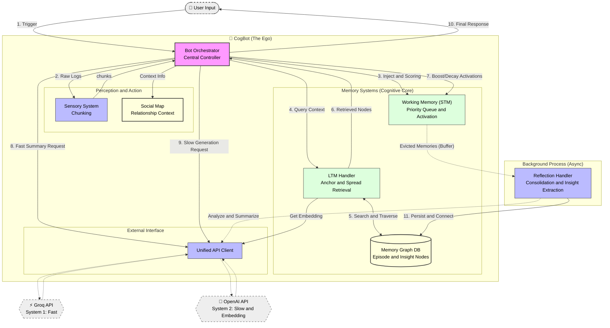

# 🧠 CogBot: Human-like Cognitive AI Agent

> **"기억하고, 느끼고, 스스로 성장하는 AI"**
> CogBot은 단순한 RAG(검색 증강 생성)를 넘어, 인간의 **인지 심리학적 모델(Cognitive Psychology)**을 공학적으로 구현한 차세대 챗봇 프레임워크입니다.

---

## 🌟 핵심 철학 (Core Philosophy)

CogBot은 인간의 뇌가 작동하는 방식을 모방하여 설계되었습니다.

1. **Dual-Process Theory (이중 처리 이론):**
* **System 1 (Fast):** Groq(Llama3)를 이용해 상황을 빠르게 파악하고 직관적으로 맥락을 요약합니다.
* **System 2 (Slow):** OpenAI(GPT-4o)를 이용해 깊이 있게 사고하고, 감정을 분석하며, 기억을 성찰합니다.


2. **Associative Memory (연상 기억):**
* 기억은 파일 폴더가 아니라 **그래프(Graph)**로 저장됩니다.
* "비 오는 날"이라는 단어는 "파전"이라는 기억을, 파전은 "작년의 추억"을 연쇄적으로 불러옵니다.


3. **Active Forgetting (능동적 망각):**
* 모든 것을 기억하지 않습니다. 중요하지 않거나(Low Importance), 자주 회상되지 않는(Low Frequency) 기억은 자연스럽게 잊혀집니다.


---

## 🏗️ 시스템 아키텍처 (Architecture)

### 1. 인지 파이프라인 (Cognitive Pipeline)

`BotOrchestrator`가 중앙에서 다음 4단계 루프를 제어합니다.

1. **지각 (Perception):** `SensorySystem`이 파편화된 채팅 로그를 의미 단위(Chunk)로 병합합니다.
2. **기억 인출 (Retrieval & Attention):**
* **Anchor & Spread:** 벡터 유사도로 핵심 기억(Anchor)을 찾고, 그래프 엣지를 타고 연관 기억(Spread)을 확장합니다.
* **STM Scoring:** 인출된 기억과 관련된 작업 기억(STM)을 강화(Boost)하고, 나머지는 약화(Decay)시킵니다.


3. **사고 (Cognition):** System 1(Groq)이 현재 상황을 요약하고, System 2(GPT-4)가 페르소나와 감정에 맞춰 답변을 생성합니다.
4. **성찰 (Reflection):** STM에서 밀려난(Evicted) 기억들은 백그라운드에서 `Insight`(통찰)와 `Episode`(사건)로 정제되어 LTM 그래프에 저장됩니다.

### 2. 메모리 구조 (Memory Structure)

| 구성 요소 | 역할 | 저장 방식 | 비고 |
| --- | --- | --- | --- |
| **STM (작업 기억)** | 현재 대화 맥락 유지 | **Priority Queue** (Activation 기반) | 참조되지 않으면 방출(Eviction)됨 |
| **LTM (장기 기억)** | 영구적인 사건 및 지식 | **Two-Tier Graph** (JSON Persistence) | Episode Layer + Insight Layer |
| **Social Map** | 유저별 관계 및 호감도 | **Key-Value Store** (JSON) | 호감도에 따라 말투/태도 변화 |

---

## 📂 프로젝트 구조 (Directory Structure)

모듈화된 구조로 유지보수성과 확장성을 확보했습니다.

```bash
CogBot/
├── main.py                 # 🚀 실행 엔트리 포인트
├── config.py               # ⚙️ 설정 중앙 관리 (API Key, 임계값 등)
├── api_client.py           # 🌐 통합 API 클라이언트 (OpenAI, Groq)
├── memory_structures.py    # 📦 데이터 클래스 (DTO) 정의
├── bot_orchestrator.py     # 🧠 중앙 제어 장치 (The Ego)
│
└── modules/                # 🧩 기능별 모듈
    ├── sensory_system.py   # 감각: 채팅 청킹(Chunking)
    ├── stm_handler.py      # STM: 우선순위 큐 및 활성화 관리
    ├── ltm_graph.py        # LTM: 그래프 데이터베이스 로직
    ├── ltm_handler.py      # LTM: 앵커 & 스프레드 검색 알고리즘
    ├── reflection_handler.py # 성찰: 백그라운드 기억 정리 및 저장
    └── social_module.py    # 사회성: 호감도 관리

```

---

## 🚀 설치 및 시작 (Getting Started)

### 1. 요구 사항

* Python 3.9+
* API Keys:
* **OpenAI API Key** (Intelligence & Embedding)
* **Groq API Key** (Fast Inference)


### 2. 설치

```bash
# 레포지토리 클론
git clone https://github.com/your-username/CogBot.git
cd CogBot

# 의존성 설치
pip install openai groq numpy

```

### 3. 설정 (`config.py` 또는 환경 변수)

```python
# config.py 예시
import os

OPENAI_API_KEY = "sk-..."
GROQ_API_KEY = "gsk-..."

# 모델 설정
SMART_MODEL = "gpt-4o"
FAST_MODEL = "llama3-70b-8192"

```

### 4. 실행

```python
# main.py 예시
from bot_orchestrator import BotOrchestrator

bot = BotOrchestrator()

# 대화 시뮬레이션
response = bot.process_trigger(
    history=[], 
    current_msg_data={"user_id": "user1", "msg": "나 요즘 너무 우울해..."}
)
print(response) 
# 예상: "저런, 무슨 일 있어? 저번에도 회사 때문에 힘들다고 했잖아. [EMOTION:sadness]"

```

---

## 🧠 기술적 특징 상세 (Deep Dive)

### 1. 이층 그래프 메모리 (Two-Tier Graph Memory)

LTM은 두 가지 층위의 노드로 구성됩니다.

* **Episode Node:** "2024년 5월 5일, 철수가 민트초코를 먹고 뱉었다." (불변의 사건)
* **Insight Node:** "철수는 민트초코를 싫어한다." (가변의 지식)
* **Wiring:** 이 둘은 `Evidence Edge`로 연결되어, 사건을 통해 성향을 추론하고 성향을 통해 사건을 회상합니다.

### 2. 하이브리드 검색 (Anchor & Spread Retrieval)

단순 임베딩 검색의 한계를 극복했습니다.

1. **Anchor:** 벡터 유사도로 가장 관련성 높은 `Insight`를 먼저 찾습니다. (지식 우선)
2. **Spread:** 그래프 엣지를 타고 연결된 `Episode`를 끌어옵니다. (맥락 보강)
3. **Rerank:** 현재 기분(Mood Congruence)과 시간(Recency)을 고려해 최종 순위를 매깁니다.

### 3. 비동기 성찰 (Asynchronous Reflection)

봇이 대화하는 도중에도 백그라운드 스레드(`ReflectionHandler`)가 작동합니다.

* STM에서 잊혀진(Evicted) 기억 조각들을 모읍니다.
* LLM을 사용해 이를 요약하고 통찰을 추출하여 LTM 그래프에 영구 저장(Persistence)합니다.

### 4. CogBot Architecture Diagram



---

### 🖼️ 다이어그램 설명

이 다이어그램은 CogBot의 데이터 흐름과 핵심 컴포넌트 간의 관계를 보여줍니다.

1. **중앙 제어 (The Ego):** `Bot Orchestrator`가 모든 인지 과정의 중심에서 입력을 받고, 기억을 조회하며, 최종 행동(답변)을 결정합니다.
2. **이중 처리 (Dual Process):**
* **System 1 (Fast):** Groq API를 통해 빠른 맥락 요약과 직관적인 처리를 수행합니다.
* **System 2 (Slow):** OpenAI API를 통해 깊은 사고, 감정 분석, 그리고 기억의 성찰(Reflection)을 수행합니다.


3. **메모리 순환 (Memory Cycle):**
* 입력된 정보는 `STM`(작업 기억)에서 활성화됩니다.
* `LTM Handler`가 `Memory Graph`에서 관련된 장기 기억을 인출(Retrieval)합니다.
* STM에서 중요도가 떨어진 기억은 방출(Eviction)되어 `Reflection Handler`로 전달됩니다.


4. **비동기 성찰 (Async Reflection):** 백그라운드에서 작동하는 `Reflection Handler`가 방출된 기억을 분석하여 통찰(Insight)을 추출하고, 이를 다시 `Memory Graph`에 영구적으로 저장하며 지식을 확장합니다.

---

## 🔮 Future Roadmap

* **Vector DB Migration:** 데이터가 커질 경우 JSON 파일에서 ChromaDB 또는 Pinecone으로 마이그레이션.
* **Graph Visualization:** 봇의 머릿속(기억 그래프)을 시각화하는 대시보드 구현.
* **Multi-Modal:** 텍스트뿐만 아니라 이미지(시각) 기억 기능 추가.

---

> **Note:** 이 프로젝트는 실험적인 인지 아키텍처 구현체입니다. 실제 서비스 적용 시 데이터 보안 및 비용(LLM API Cost)을 고려하십시오.