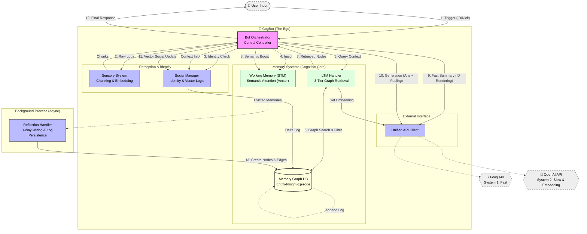

# 🧠 CogBot: Human-like Cognitive AI Agent (v4)

> **"기억하고, 느끼고, 관계를 맺으며 성장하는 AI"**
> CogBot은 단순한 RAG(검색 증강 생성)를 넘어, **인지 심리학(Cognitive Psychology)** 이론과 **사회적 지능(Social Intelligence)**을 공학적으로 구현한 차세대 챗봇 프레임워크입니다.

---

## 🌟 핵심 철학 (Core Philosophy)

CogBot은 인간의 뇌와 사회적 상호작용 방식을 모방하여 설계되었습니다.

1. **Dual-Process Theory (이중 처리 이론):**
* **System 1 (Fast):** Groq(Llama3)를 이용해 상황을 빠르게 파악하고 직관적으로 맥락을 요약합니다.
* **System 2 (Slow):** OpenAI(GPT-4o)를 이용해 깊이 있게 사고하고, 섬세한 **자연어 감정(Natural Language Emotion)**을 생성하며, 기억을 성찰합니다.


2. **3-Tier Associative Memory (3단계 연상 기억):**
* 기억은 **Entity(인물) - Insight(지식) - Episode(사건)**의 3단계 층위를 가진 **그래프(Graph)**로 저장됩니다.
* 단순한 사실 저장을 넘어, "누구와(Entity) 어떤 사건(Episode)이 있었고, 그로 인해 어떤 사실(Insight)을 알게 되었는가"를 유기적으로 연결합니다.


3. **Vector-based Social Dynamics (벡터 기반 사회성):**
* 인간관계는 룰(Rule)이 아닙니다. 봇이 생성한 **감정의 벡터(Vector)**와 **긍정 기준점(Positive Anchor)** 사이의 거리를 계산하여, 호감도와 관계가 수학적으로 시뮬레이션됩니다.


---

## 🏗️ 시스템 아키텍처 (Architecture)

### 1. 인지 파이프라인 (Cognitive Pipeline)

`BotOrchestrator`가 중앙에서 다음 4단계 루프를 제어합니다.

1. **지각 & 정체성 (Perception & Identity):**
* **Sensory System:** 대화 로그를 의미 단위(Chunk)로 병합하고 임베딩을 생성합니다.
* **Identity Check:** 유저의 `user_id`(불변)와 `nickname`(가변)을 매핑하여, 닉네임이 바뀌어도 동일 인물로 인식하며 변경 이력을 추적합니다.


2. **기억 인출 & 주의 집중 (Retrieval & Attention):**
* **3-Tier Search:** 그래프 탐색을 통해 나(Entity)와 연결된 사건(Episode) 및 지식(Insight)을 인출합니다.
* **Semantic Attention:** STM 내부에서 단순 키워드 매칭이 아닌, **임베딩 유사도**를 통해 현재 대화 주제와 의미적으로 연결된 기억의 수명을 연장(Boost)합니다.


3. **사고 및 행동 (Cognition & Action):**
* **ID Rendering:** 내부적으로는 고유 ID로 사고하되, 답변 생성 시에는 최신 닉네임으로 자연스럽게 치환하여 표현합니다.
* **Vector Social Logic:** 답변과 함께 생성된 **자연어 감정(예: "묘한 설렘")**을 벡터화하고, 이를 '행복/신뢰' 앵커 벡터와 비교(Cosine Similarity)하여 호감도를 자동으로 업데이트합니다.


4. **성찰 (Reflection):**
* STM에서 밀려난(Evicted) 기억들은 백그라운드에서 분석되어 **3-Tier Graph**에 저장됩니다. 이때 Entity-Insight-Episode 간의 **Edge(연결)**가 형성됩니다.


### 2. 메모리 구조 (Memory Structure)

| 구성 요소 | 역할 | 저장 방식 | 비고 |
| --- | --- | --- | --- |
| **STM (작업 기억)** | 현재 대화 맥락 유지 | **Priority Queue** (Vector Activation) | 의미적 관련성 낮으면 방출(Eviction) |
| **LTM (장기 기억)** | 영구적인 기억 저장소 | **3-Tier Graph** (JSONL Delta Log) | Entity + Insight + Episode Nodes |
| **Graph DB** | 노드 및 엣지 관리 | **Append-only Log** (Performance Optimized) | Snapshot + Delta Replay 방식 |

---

## 📂 프로젝트 구조 (Directory Structure)

모듈화된 구조로 유지보수성과 확장성을 확보했습니다.

```bash
CogBot/
├── main.py                 # 🚀 실행 엔트리 포인트
├── config.py               # ⚙️ 설정 (API Key, Positive Anchor, Thresholds)
├── api_client.py           # 🌐 통합 API 클라이언트 (OpenAI, Groq)
├── memory_structures.py    # 📦 데이터 클래스 (DTO: 3-Tier Nodes 정의)
├── bot_orchestrator.py     # 🧠 중앙 제어 장치 (The Ego & Logic)
│
└── modules/                # 🧩 기능별 모듈
    ├── sensory_system.py   # 감각: 청킹, 임베딩, 화자 식별
    ├── stm_handler.py      # STM: 벡터 유사도 기반 주의 집중(Attention)
    ├── ltm_graph.py        # LTM: Append-only Log 기반 그래프 DB 엔진
    ├── ltm_handler.py      # LTM: 3-Tier 그래프 탐색 및 접근 제어
    ├── reflection_handler.py # 성찰: 백그라운드 구조화 및 엣지 연결
    └── social_module.py    # 사회성: 정체성 관리 및 벡터 호감도 계산

```

---

## 🚀 설치 및 시작 (Getting Started)

### 1. 요구 사항

* Python 3.9+
* API Keys:
* **OpenAI API Key** (Intelligence & Embedding)
* **Groq API Key** (Fast Inference)


### 2. 설치

```bash
# 레포지토리 클론
git clone https://github.com/your-username/CogBot.git
cd CogBot

# 의존성 설치
pip install openai groq numpy

```

### 3. 설정 (`config.py`)

```python
# config.py
POSITIVE_EMOTION_ANCHOR = "joyful trust and happiness" # 호감도 기준점
SOCIAL_SENSITIVITY = 5.0 # 감정 변화 민감도

# LTM Storage Strategy
LTM_GRAPH_PATH = "ltm_graph.json" # Snapshot
# Delta Log는 "ltm_graph_delta.jsonl"로 자동 생성됨

```

### 4. 실행

```python
from bot_orchestrator import BotOrchestrator

bot = BotOrchestrator()

# 1. 닉네임 변경 테스트
bot.process_trigger([], {"user_id": "1001", "user_name": "NewNick", "msg": "안녕!"})
# -> SocialManager가 닉네임 변경 감지 및 History 기록

# 2. 감정 및 관계 변화 테스트
response = bot.process_trigger([], {"user_id": "1001", "msg": "너 오늘 좀 별로다."})
# -> 봇: "뭐라고? 말이 심하네. [FEELING:불쾌함]" 
# -> '불쾌함' 벡터와 '행복' 벡터의 거리 계산 -> 호감도 하락

```

---

## 🧠 기술적 특징 상세 (Deep Dive)

### 1. 3-Tier Graph Memory Architecture

LTM은 세 가지 층위의 노드가 유기적으로 연결된 그래프 구조입니다.

* **Entity Node (인물):** 유저의 정체성 (ID, 닉네임 이력, 호감도).
* **Insight Node (지식):** 사건에서 추출된 성향이나 사실.
* **Episode Node (사건):** 실제 대화 로그와 당시의 감정(Natural Emotion).
* **Wiring:** `Entity` -(참여)-> `Episode` -(증거)-> `Insight` -(대상)-> `Entity` 로 연결되어, "누가 겪은 일이고, 그래서 어떤 사람인가"를 추론합니다.

### 2. Append-only Log Storage (고성능 저장소)

대용량 JSON 파일을 매번 덮어쓰는 비효율을 제거했습니다.

* **Write:** 변경 사항(Delta)을 `.jsonl` 파일 끝에 한 줄씩 추가 (O(1) 속도).
* **Read:** 봇 시작 시 `Snapshot` + `Delta Log`를 리플레이하여 메모리 상태 복원.
* **Compaction:** 주기적으로 로그를 병합하여 스냅샷 갱신.

### 3. Vector-based Social Logic

복잡한 `if-else` 룰 없이, LLM의 언어 능력과 벡터 연산을 결합했습니다.

1. LLM이 답변과 함께 **자연어 감정 태그(예: "묘한 설렘")**를 생성.
2. `SocialManager`가 이를 벡터화하여 **긍정 기준점(Positive Anchor)**과 코사인 유사도 계산.
3. 유사도에 따라 관계 점수(Affinity)가 **연속적(Continuous)으로 변화**.

### 4. CogBot Architecture Diagram



---

## 🔮 Future Roadmap

* **Vector DB Migration:** 데이터 규모 증가 시 `_embeddings_cache`를 Pinecone/Chroma로 이관 (코드 구조 변경 없이 가능).
* **Graph Visualization Dashboard:** 봇의 기억 구조와 관계도를 시각적으로 보여주는 웹 대시보드.
* **Multi-Modal Memory:** 이미지 및 음성 기억을 `EpisodeNode`에 통합.

---

> **Note:** 이 프로젝트는 실험적인 인지 아키텍처 구현체입니다. 실제 서비스 적용 시 데이터 보안 및 LLM 비용을 고려하십시오.