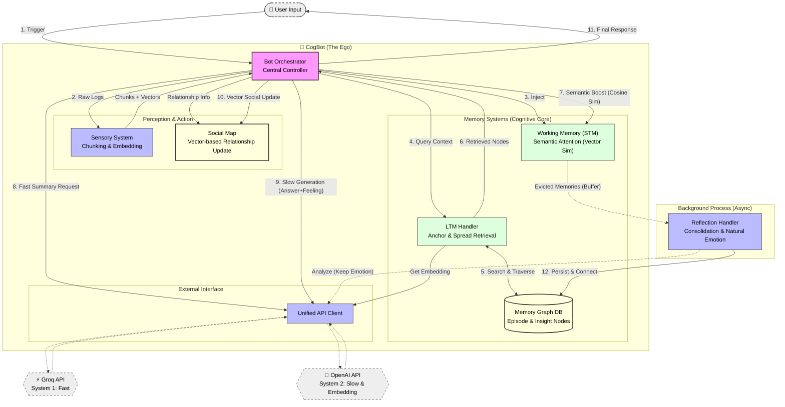

# 🧠 CogBot: Human-like Cognitive AI Agent

> **"기억하고, 느끼고, 스스로 성장하는 AI"**
> CogBot은 단순한 RAG(검색 증강 생성)를 넘어, 인간의 **인지 심리학적 모델(Cognitive Psychology)**을 공학적으로 구현한 차세대 챗봇 프레임워크입니다.

---

## 🌟 핵심 철학 (Core Philosophy)

CogBot은 인간의 뇌가 작동하는 방식을 모방하여 설계되었습니다.

1. **Dual-Process Theory (이중 처리 이론):**
* **System 1 (Fast):** Groq(Llama3)를 이용해 상황을 빠르게 파악하고 직관적으로 맥락을 요약합니다.
* **System 2 (Slow):** OpenAI(GPT-4o)를 이용해 깊이 있게 사고하고, 섬세한 자연어 감정을 생성하며, 기억을 성찰합니다.


2. **Associative Memory (연상 기억):**
* 기억은 파일 폴더가 아니라 **그래프(Graph)**로 저장됩니다.
* "비 오는 날"이라는 단어는 "파전"이라는 기억을, 파전은 "작년의 추억"을 연쇄적으로 불러옵니다.


3. **Active Forgetting (능동적 망각):**
* 모든 것을 기억하지 않습니다. 중요하지 않거나(Low Importance), 자주 회상되지 않는(Low Frequency) 기억은 자연스럽게 잊혀집니다.


---

## 🏗️ 시스템 아키텍처 (Architecture)

### 1. 인지 파이프라인 (Cognitive Pipeline)

`BotOrchestrator`가 중앙에서 다음 4단계 루프를 제어합니다.

1. **지각 (Perception):** `SensorySystem`이 파편화된 채팅 로그를 의미 단위(Chunk)로 병합하고, 임베딩을 부여하여 STM에 주입합니다.
2. **기억 인출 & 주의 집중 (Retrieval & Attention):**
* **Anchor & Spread:** 벡터 유사도로 LTM에서 핵심 기억(Anchor)을 찾고, 그래프 엣지를 타고 연관 기억(Spread)을 확장합니다.
* **Vector-based Attention:** 단순 키워드 매칭이 아닌, **임베딩 유사도**를 통해 현재 대화 주제와 의미적으로 연결된 STM 기억들의 수명을 연장(Boost)합니다.


3. **사고 및 행동 (Cognition & Action):**
* **Generation:** System 2(GPT-4)가 페르소나에 맞춰 답변하고, 10자 이내의 **자연어 감정(Natural Language Emotion)**을 생성합니다.
* **Social Update:** 생성된 '현재 감정 벡터'와 '긍정 기준(Positive Anchor) 벡터'의 **코사인 유사도**를 계산하여 유저와의 관계(호감도)를 수학적으로 업데이트합니다.


4. **성찰 (Reflection):** STM에서 밀려난(Evicted) 기억들은 감정 태그를 보존한 채 백그라운드에서 `Insight`(통찰)와 `Episode`(사건)로 정제되어 LTM 그래프에 저장됩니다.

### 2. 메모리 구조 (Memory Structure)

| 구성 요소 | 역할 | 저장 방식 | 비고 |
| --- | --- | --- | --- |
| **STM (작업 기억)** | 현재 대화 맥락 유지 | **Priority Queue** (Activation 기반) | 참조되지 않으면 방출(Eviction)됨 |
| **LTM (장기 기억)** | 영구적인 사건 및 지식 | **Two-Tier Graph** (JSON Persistence) | Episode Layer + Insight Layer |
| **Social Map** | 유저별 관계 및 호감도 | **Key-Value Store** (JSON) | 벡터 유사도 기반 자동 업데이트 |

---

## 📂 프로젝트 구조 (Directory Structure)

모듈화된 구조로 유지보수성과 확장성을 확보했습니다.

```bash
CogBot/
├── main.py                 # 🚀 실행 엔트리 포인트
├── config.py               # ⚙️ 설정 중앙 관리 (API Key, Positive Anchor 등)
├── api_client.py           # 🌐 통합 API 클라이언트 (OpenAI, Groq)
├── memory_structures.py    # 📦 데이터 클래스 (DTO) 정의
├── bot_orchestrator.py     # 🧠 중앙 제어 장치 (The Ego & Logic)
│
└── modules/                # 🧩 기능별 모듈
    ├── sensory_system.py   # 감각: 채팅 청킹 및 임베딩 생성
    ├── stm_handler.py      # STM: 우선순위 큐 및 벡터 기반 활성화 관리
    ├── ltm_graph.py        # LTM: 그래프 데이터베이스 로직
    ├── ltm_handler.py      # LTM: 앵커 & 스프레드 검색 알고리즘
    ├── reflection_handler.py # 성찰: 백그라운드 기억 정리 및 저장
    └── social_module.py    # 사회성: 호감도 관리 및 영속성


```

---

## 🚀 설치 및 시작 (Getting Started)

### 1. 요구 사항

* Python 3.9+
* API Keys:
* **OpenAI API Key** (Intelligence & Embedding)
* **Groq API Key** (Fast Inference)


### 2. 설치

```bash
# 레포지토리 클론
git clone https://github.com/your-username/CogBot.git
cd CogBot

# 의존성 설치
pip install openai groq numpy

```

### 3. 설정 (`config.py` 또는 환경 변수)

```python
# config.py 예시
import os

OPENAI_API_KEY = "sk-..."
GROQ_API_KEY = "gsk-..."

# 모델 설정
SMART_MODEL = "gpt-4o"
FAST_MODEL = "llama3-70b-8192"

# 사회성 로직 설정
POSITIVE_EMOTION_ANCHOR = "joyful trust and happiness" # 호감도 상승 기준점
SOCIAL_SENSITIVITY = 5.0 

```

### 4. 실행

```python
# main.py 예시
from bot_orchestrator import BotOrchestrator

bot = BotOrchestrator()

# 대화 시뮬레이션
response = bot.process_trigger(
    history=[], 
    current_msg_data={"user_id": "user1", "msg": "너 오늘 말이 좀 심하다?"}
)
print(response) 
# 예상: "미안해, 내가 좀 예민했나 봐. [FEELING:위축됨]"
# -> '위축됨' 벡터와 '행복' 벡터의 거리를 계산해 관계 점수 자동 하락

```

---

## 🧠 기술적 특징 상세 (Deep Dive)

### 1. 이층 그래프 메모리 (Two-Tier Graph Memory)

LTM은 두 가지 층위의 노드로 구성되며, 자연어 감정 태그가 그대로 보존됩니다.

* **Episode Node:** "2026년 1월 26일, 유저가 나를 비난함. (Feeling: 싸늘한 분노)"
* **Insight Node:** "유저는 무례한 농담을 싫어한다."
* **Wiring:** 이 둘은 `Evidence Edge`로 연결되어 사건과 성향을 상호 참조합니다.

### 2. 벡터 기반 주의 집중 (Semantic Attention)

STM 내부의 기억 관리는 단순 키워드 매칭이 아닌 **임베딩 유사도**를 사용합니다.

* 유저가 "배고파"라고 말하면, 텍스트가 달라도 "식당", "라면", "편의점" 관련 기억들의 활성도(Activation)가 상승하여 망각되지 않고 살아남습니다.

### 3. 벡터 기반 사회성 로직 (Vector-based Social Logic)

복잡한 룰 베이스 없이, LLM의 감정 이해 능력과 벡터 연산을 결합했습니다.

1. LLM이 답변과 함께 **자연어 감정(예: "묘한 설렘")**을 생성합니다.
2. 이 감정을 벡터화하여 **긍정 기준점(Positive Anchor)**과의 코사인 유사도를 계산합니다.
3. 유사도가 높으면 관계 점수 상승, 낮거나 반대면 하락합니다.

### 4. CogBot Architecture Diagram



---

## 🔮 Future Roadmap

* **Vector DB Migration:** 데이터가 커질 경우 JSON 파일에서 ChromaDB 또는 Pinecone으로 마이그레이션.
* **Graph Visualization:** 봇의 머릿속(기억 그래프)을 시각화하는 대시보드 구현.
* **Multi-Modal:** 텍스트뿐만 아니라 이미지(시각) 기억 기능 추가.

---

> **Note:** 이 프로젝트는 실험적인 인지 아키텍처 구현체입니다. 실제 서비스 적용 시 데이터 보안 및 비용(LLM API Cost)을 고려하십시오.