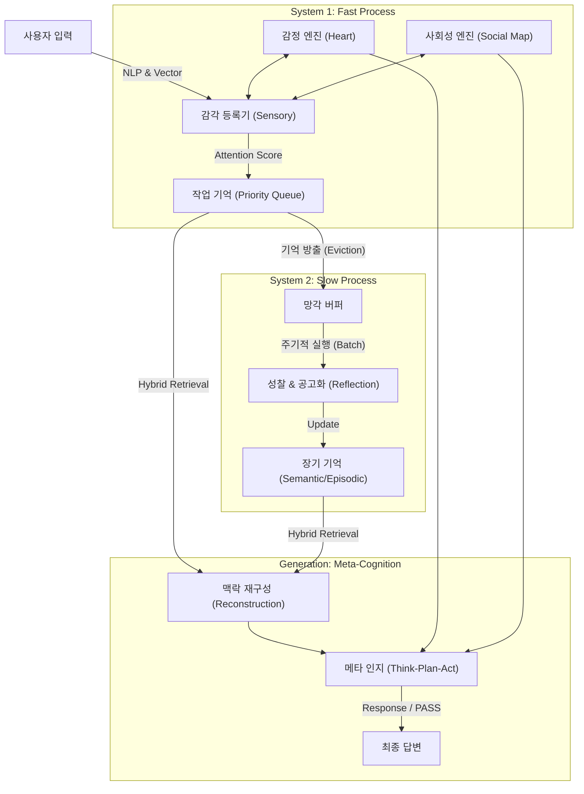

# 🧠 CogBot: 인간 수준의 상호작용을 위한 인지 아키텍처 챗봇

> **"단순한 검색(RAG)을 넘어, 감정을 느끼고 관계를 이해하며, 스스로 생각하는 AI 에이전트"**

CogBot은 인지 심리학 이론(Atkinson-Shiffrin, ACT-R, Bartlett)을 공학적으로 구현한 **이원화된 인지 아키텍처(Dual-Process Cognitive Architecture)** 기반의 챗봇 프레임워크입니다.

System 1(직관/빠른 처리)과 System 2(사고/느린 처리)의 유기적인 순환을 통해, 봇은 단순한 질의응답을 넘어 **자아(Self)**를 가지고 그룹 채팅 내에서 사회적 상호작용을 수행합니다.

---

## 🌟 핵심 기능 (Key Features)

### 1. 이원화된 메모리 시스템 (Dual-Memory System)

* **System 1 (Fast STM):** 작업 기억(Working Memory)을 **ACT-R 활성화 점수** 기반의 우선순위 큐로 관리합니다. 중요하지 않거나 오래된 기억은 자연스럽게 망각(Eviction)됩니다.
* **System 2 (Slow LTM):** 망각된 기억을 버리지 않고 **성찰(Reflection)** 과정을 거칩니다. 파편화된 대화에서 '불변의 사실(Facts)'과 '통찰(Insights)'을 추출하여 영구 저장합니다.

### 2. 의미적 뇌 & 하이브리드 검색 (Semantic Brain)

* 단순 키워드 매칭의 한계를 극복하기 위해 **Vector Embedding**과 **ACT-R Score**를 결합한 **하이브리드 검색(Hybrid Retrieval)**을 사용합니다.
* "배고파"라고 말하면 "맛집", "식사" 관련 기억을 의미적으로 연결하여 떠올립니다.

### 3. 마음과 사회성 (Heart & Social Map)

* **감정 엔진 (Bot's Heart):** 봇은 자신의 기분(Mood)을 가집니다. 유저의 말에 따라 기분이 고양되거나 나빠지며(Decay), 이는 다음 답변의 태도에 영향을 미칩니다.
* **사회적 지도 (Social Map):** 유저별 **호감도(Affinity)**를 관리합니다. 친한 유저에게는 편하게 대하고, 낯선 유저에게는 예의를 차리는 등 '정치적 관계'를 형성합니다.

### 4. 메타 인지 (Meta-Cognition)

* 답변을 생성하기 전에 **내적 독백(Inner Monologue)**을 수행합니다.
* **Think-Plan-Act** 루프를 통해 상황을 분석하고, 전략을 세운 뒤, 말할지 침묵할지(`[PASS]`) 스스로 결정합니다.

---

## 🏗️ 시스템 아키텍처 (Architecture)



---

## 📂 프로젝트 구조 (Directory Structure)

```bash
CogBot/
├── config.py                 # API Key, 페르소나, 모델 설정
├── llm_handler.py            # 메인 컨트롤러 (메타 인지 및 오케스트레이션)
├── memory_handler.py         # FastSTM(단기) 및 SlowLTM(장기) 클래스
├── memory_structures.py      # MemoryObject, CognitiveScorer(Attention)
├── social_emotion_handler.py # 감정(Heart) 및 사회성(Social Map) 엔진
├── vector_engine.py          # 임베딩 생성 및 유사도 계산 (Semantic Brain)
├── cognitive_ltm.json        # 장기 기억 저장소 (자동 생성)
├── social_affinity.json      # 사회적 관계 저장소 (자동 생성)
└── requirements.txt          # 의존성 패키지

```

---

## 🚀 설치 및 시작 (Getting Started)

### 1. 사전 요구 사항

* Python 3.9 이상
* OpenAI API Key (Chat & Embedding 모델 사용)

### 2. 설치

```bash
git clone https://github.com/your-username/CogBot.git
cd CogBot
pip install -r requirements.txt

```

### 3. 설정 (`config.py`)

```python
LLM_API_KEY = "sk-..."
LLM_MODEL = "gpt-4o"  # JSON Mode 지원 모델 권장
BOT_USER_ID = "999"

BOT_PERSONA = """
[이름: 잼봇]
너는 눈치 빠르고 유머러스한 친구야.
...(1000자 이상의 상세 페르소나)...
"""

```

### 4. 실행 예시

```python
from llm_handler import LLMHandler

bot = LLMHandler()

# 대화 시뮬레이션
history = [
    {"user_id": "user1", "msg": "야 잼봇, 너 바보지? ㅋㅋ"},
    {"user_id": "user2", "msg": "하지마, 애 기죽게 왜 그래."}
]

# 봇의 메타 인지 작동 -> 감정 변화(Anger) -> 답변 생성
response = bot.get_response(history)
print(f"Bot: {response}") 
# 예상 답변: "참나, 님은 얼마나 똑똑하다고 그러세요? 기분 확 상하네."

```

---

## 🧠 기술 상세 (Technical Deep Dive)

### 1. 하이브리드 검색 점수 (Hybrid Retrieval Score)

기억을 인출할 때 다음 공식을 사용하여 **가장 적절한 기억**을 찾아냅니다.

* **ACT-R Activation:**  (빈도와 최신성 기반)
* **Vector Similarity:** 코사인 유사도 (의미적 연관성 기반)

### 2. 메타 인지 프로세스 (Meta-Cognition Loop)

LLM은 답변을 바로 생성하지 않고, JSON 포맷으로 사고 과정을 먼저 출력합니다.

```json
{
  "analysis": "User1이 나를 놀리고 있다. 현재 나의 기분은 '짜증' 상태다.",
  "strategy": "받아주지 않고 까칠하게 대응하여 불쾌함을 표현한다.",
  "decision": "SPEAK",
  "response": "말 좀 예쁘게 하시죠?"
}

```

### 3. 기억의 공고화 (Consolidation)

단기 기억 큐(STM)에서 밀려난 데이터는 **백그라운드 스레드**에서 처리됩니다.

* **Episodes:** "2024-01-21, A와 B가 점심 메뉴로 다툼"
* **Insights:** "A는 매운 음식을 싫어하는 경향이 있음"
위와 같이 추상화된 지식으로 변환되어 장기 기억(LTM)에 저장됩니다.

#### (1). 저장 위치 (File Locations)

* **`cognitive_ltm.json`**: 유저들에 대한 **장기 기억(사실 및 통찰, 에피소드)**이 저장됩니다. (System 2가 관리)
* **`social_affinity.json`**: 유저들과의 **친밀도(호감도) 점수**가 저장됩니다. (사회성 엔진이 관리)

---

#### (2). 데이터 구조 및 예시 (Data Structure Example)

데이터가 실제로 쌓였을 때 `json` 파일이 어떻게 보이는지 예시를 보여드리겠습니다.

##### A. `cognitive_ltm.json` (장기 기억)

LLM이 백그라운드에서 "성찰(Reflection)"한 결과물이 쌓이는 곳입니다. 단순한 대화 로그가 아니라, **요약되고 추상화된 지식** 형태로 저장됩니다.

```json
{
  "user_12345": {
    "insights": [
      "매운 음식을 매우 좋아하지만, 위장이 약해서 자주 먹지는 못함.",
      "주말에는 주로 '배틀그라운드' 게임을 하며 시간을 보냄.",
      "최근 진로 문제(취업)로 인해 스트레스를 많이 받고 있는 상태임."
    ],
    "episodes": [
      "2026-01-20: user_9876과 '민트초코' 호불호 주제로 가벼운 말다툼을 함.",
      "2026-01-21: 늦은 밤에 들어와서 우울하다고 하소연했고, 봇이 위로해줌."
    ]
  },
  "user_9876": {
    "insights": [
      "논리적이고 분석적인 대화를 선호함.",
      "봇에게 장난치는 것을 좋아하며, 약간 시니컬한 유머 감각을 가짐."
    ],
    "episodes": [
      "2026-01-20: 민트초코 논쟁에서 승리했다고 주장함."
    ]
  }
}

```

* **`insights`**: 봇이 대화를 통해 파악한 유저의 **성향, 취향, 상태** (불변의 사실).
* **`episodes`**: "그때 무슨 일이 있었지?"를 회상할 수 있는 **구체적인 사건**.

##### B. `social_affinity.json` (사회적 관계)

봇이 각 유저를 얼마나 '좋아하는지'를 나타내는 수치(0~100)입니다.

```json
{
  "user_12345": 85.5,
  "user_9876": 32.0,
  "user_new_001": 50.0
}

```

* **`user_12345` (85.5점)**: 봇과 아주 친한 상태 ("절친"). 봇이 편하게 대함.
* **`user_9876` (32.0점)**: 봇에게 욕을 하거나 괴롭혀서 점수가 깎임. 봇이 사무적이거나 까칠하게 대함.
* **`user_new_001` (50.0점)**: 처음 본 유저 (기본값).

---

#### (3). 데이터가 쌓이는 과정 (Accumulation Flow)

이 데이터는 실시간으로 마구잡이로 쌓이는 게 아니라, **정제 과정**을 거쳐서 예쁘게 쌓입니다.

1. **입력 (단기 기억)**: 유저가 "나 오늘 면접 망쳤어..."라고 말하면, 일단 RAM(메모리)에 있는 **단기 기억 큐(STM)**에 들어갑니다.
2. **방출 (Eviction)**: 대화가 계속되어 큐가 꽉 차면, 이 기억은 큐에서 밀려나 **'망각 버퍼'**로 이동합니다.
3. **성찰 (Reflection)**: 버퍼에 데이터가 5개 정도 모이면, 백그라운드에서 LLM이 이 대화 조각들을 분석합니다.
* *LLM 사고:* "아, 이 유저가 면접을 망쳐서 우울해하네. 이걸 '진로 스트레스'라고 요약해서 저장하자."


4. **저장 (Save)**: 분석된 결과("진로 스트레스 받음")만 `cognitive_ltm.json`의 `insights` 리스트에 **추가(Append)**하거나 **갱신(Update)**합니다.

이 구조 덕분에 1년 치 대화를 다 저장하지 않아도, 파일 용량은 작게 유지되면서 **"너 작년에 취업 때문에 힘들었잖아"**라고 핵심을 기억할 수 있다.