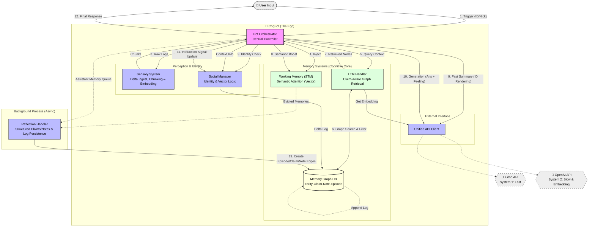

# 🧠 CogBot: Human-like Cognitive AI Agent (v4)

> **"기억하고, 느끼고, 관계를 맺으며 성장하는 AI"**
> CogBot은 단순한 RAG(검색 증강 생성)를 넘어, **인지 심리학(Cognitive Psychology)** 이론과 **사회적 지능(Social Intelligence)**을 공학적으로 구현한 차세대 챗봇 프레임워크입니다.

---

## 🌟 핵심 철학 (Core Philosophy)

CogBot은 인간의 뇌와 사회적 상호작용 방식을 모방하여 설계되었습니다.

1. **Dual-Process Theory (이중 처리 이론):**
* **System 1 (Fast):** Groq(Llama3)를 이용해 상황을 빠르게 파악하고 직관적으로 맥락을 요약합니다.
* **System 2 (Slow):** OpenAI(GPT-4o)를 이용해 깊이 있게 사고하고, 섬세한 **자연어 감정(Natural Language Emotion)**을 생성하며, 기억을 성찰합니다.


2. **State-first Memory Graph (상태 우선 기억 그래프):**
* 기억의 정본은 더 이상 자유문장 `Insight`가 아닙니다. 현재 구현은 **Entity(인물) - Claim(유효 상태) - Episode(증거) + Note(서사 맥락)** 구조를 중심으로 동작합니다.
* `Claim`은 이름, 상호작용 선호, 약속, 일정, 경계처럼 **업데이트 규칙이 중요한 상태**를 저장하고, `Note`는 농담, 분위기, 인상, trait hypothesis 같은 **비정본 서사**를 저장합니다.
* 기존 `InsightNode`는 하위 호환을 위해 남아 있지만, 새로운 write path는 `Claim`과 `Note`를 우선 생성합니다.


3. **Conservative Social Dynamics (보수적 사회성 갱신):**
* 관계는 더 이상 단일 임베딩 유사도만으로 갱신되지 않습니다. 현재 구현은 **사용자 발화의 톤 벡터 + 감사/불만/수정/repair/boundary respect 같은 사건 신호**를 함께 사용합니다.
* `affinity`는 호환용 요약 점수로 남아 있지만, 정본 관계 상태는 `trust / warmth / familiarity / respect / tension / reliability`의 다축 `RelationState`로 저장됩니다.
* 봇의 기분은 전역 문자열이 아니라 **유저별 세션 상태**로 관리되어, 한 사용자의 대화 분위기가 다른 사용자에게 섞이지 않도록 분리됩니다.


---

## 🏗️ 시스템 아키텍처 (Architecture)

### 1. 인지 파이프라인 (Cognitive Pipeline)

`BotOrchestrator`가 중앙에서 다음 4단계 루프를 제어합니다.

1. **지각 & 정체성 (Perception & Identity):**
* **Sensory System:** 대화 로그를 의미 단위(Chunk)로 병합하고 임베딩을 생성합니다.
* **Delta Ingest:** `history + current_msg` 전체를 매번 다시 처리하지 않고, 아직 처리하지 않은 로그만 받아 청킹합니다.
* **Durable Cursor:** delta ingest cursor를 파일에 영속화하고 최대 개수를 제한하되, 원문 대신 upstream message id 또는 digest만 저장해 장기 실행과 재시작 이후에도 중복 ingest를 줄입니다.
* **Identity Check:** 유저의 `user_id`(불변)와 `nickname`(가변)을 매핑하여, 닉네임이 바뀌어도 동일 인물로 인식하며 변경 이력을 추적합니다.


2. **기억 인출 & 주의 집중 (Retrieval & Attention):**
* **Claim-aware Search:** 그래프 탐색 시 `active` 상태의 `ClaimNode`를 우선 검색하고, `NoteNode`와 `EpisodeNode`를 보조 맥락으로 인출합니다.
* **Semantic Attention:** STM 내부에서 단순 키워드 매칭이 아닌, **임베딩 유사도**를 통해 현재 대화 주제와 의미적으로 연결된 기억의 수명을 연장(Boost)합니다.


3. **사고 및 행동 (Cognition & Action):**
* **ID Rendering:** 내부적으로는 고유 ID로 사고하되, 답변 생성 시에는 최신 닉네임으로 자연스럽게 치환하여 표현합니다.
* **Memory-aware Reconstruction:** LLM 프롬프트에는 `Current State(Claim)`, `Note`, `Episode`, `Legacy Insight`가 구분되어 들어갑니다.
* **Scoped Mood & Event-based Social Logic:** retrieval/generation은 **유저별 session mood**만 사용하고, 관계 갱신은 사용자 입력의 톤 벡터에 **감사/불만/수정/repair/boundary respect** 사건 신호를 합산합니다.


4. **성찰 (Reflection):**
* STM에서 밀려난(Evicted) 기억들과 assistant 응답은 백그라운드에서 분석되어 구조화됩니다.
* reflection 출력은 자유문장 `insights[]`보다 `claims[]`와 `notes[]`를 우선 생성합니다.
* 성격 추정, 농담, 순간 감정은 `Note`로 내리고, 명시적 선호/약속/경계/일정은 `Claim`으로 저장합니다.
* boundary claim은 원문 대신 topic label + non-reversible fingerprint만 저장하고, 제3자 claim은 `participants + audience_ids` ACL로 제한합니다. legacy `shared` scope는 write/load 시 `participants`로 마이그레이션됩니다.


### 2. 메모리 구조 (Memory Structure)

| 구성 요소 | 역할 | 저장 방식 | 비고 |
| --- | --- | --- | --- |
| **STM (작업 기억)** | 현재 대화 맥락 유지 | **Priority Queue** (Vector Activation) | 의미적 관련성 낮으면 방출(Eviction) |
| **Claim Node** | 현재 유효한 상태의 정본 | **Graph Node** | facet별 merge 규칙 적용, `active/superseded/...` 상태 보유 |
| **Note Node** | 서사 요약, 인상, 농담, hypothesis | **Graph Node** | retrieval용 맥락, 비정본 기억 |
| **Episode Node** | 원본 사건 및 근거 | **Graph Node** | 시간축, 감정 태그, evidence 연결 |
| **LTM Graph** | 노드 및 엣지 관리 | **Append-only Log** (JSON Snapshot + Delta Replay) | retrieval evidence와 관계 맥락을 담당 |
| **Canonical Store** | 현재 유효한 상태 정본 | **SQLite** | active claim, open loop, interaction policy, relation state 저장 |

---

## 📂 프로젝트 구조 (Directory Structure)

모듈화된 구조로 유지보수성과 확장성을 확보했습니다.

```bash
CogBot/
├── main.py                 # 🚀 실행 엔트리 포인트
├── config.py               # ⚙️ 설정 (API Key, Positive Anchor, Thresholds)
├── api_client.py           # 🌐 통합 API 클라이언트 (OpenAI, Groq)
├── memory_structures.py    # 📦 데이터 클래스 (Claim/Note/Episode/Entity 정의)
├── memory/
│   ├── __init__.py
│   └── ontology.py         # facet spec, merge policy, sensitivity 정의
├── bot_orchestrator.py     # 🧠 중앙 제어 장치 (The Ego & Logic)
│
└── modules/                # 🧩 기능별 모듈
    ├── sensory_system.py   # 감각: delta ingest, 청킹, 임베딩, 화자 식별
    ├── stm_handler.py      # STM: 벡터 유사도 기반 주의 집중(Attention)
    ├── ltm_graph.py        # LTM: Claim/Note/Episode/Entity 그래프 저장소
    ├── ltm_handler.py      # LTM: claim-aware 그래프 탐색 및 접근 제어
    ├── reflection_handler.py # 성찰: structured claims/notes 생성 및 엣지 연결
    └── social_module.py    # 사회성: 정체성 관리 및 affinity 업데이트

```

---

## 🚀 설치 및 시작 (Getting Started)

### 1. 요구 사항

* Python 3.9+
* API Keys:
* **OpenAI API Key** (Intelligence & Embedding)
* **Groq API Key** (Fast Inference)


### 2. 설치

```bash
# 레포지토리 클론
git clone https://github.com/your-username/CogBot.git
cd CogBot

# 의존성 설치
pip install openai groq numpy

```

### 3. 설정 (`config.py`)

```python
# config.py
POSITIVE_EMOTION_ANCHOR = "joyful trust and happiness" # 호감도 기준점
SOCIAL_SENSITIVITY = 5.0 # 감정 변화 민감도
API_LOGGING_ENABLED = False # 민감 프롬프트/응답 로깅 기본 비활성화
API_LOG_INCLUDE_CONTENT = False # 원문 내용 기록 비활성화

# LTM Storage Strategy
LTM_GRAPH_PATH = "ltm_graph.json" # Snapshot
# Delta Log는 "ltm_graph_delta.jsonl"로 자동 생성됨

```

### 4. 실행

```python
from bot_orchestrator import BotOrchestrator

bot = BotOrchestrator()

# 1. 닉네임 변경 테스트
bot.process_trigger([], {"user_id": "1001", "user_name": "NewNick", "msg": "안녕!"})
# -> SocialManager가 닉네임 변경 감지 및 History 기록

# 2. 감정 및 관계 변화 테스트
response = bot.process_trigger([], {"user_id": "1001", "msg": "너 오늘 좀 별로다."})
# -> 봇: "뭐라고? 말이 심하네. [FEELING:불쾌함]"
# -> 사용자의 실제 발화 벡터와 긍정 기준점의 거리 계산 -> 호감도 하락

```

---

## 🧠 기술적 특징 상세 (Deep Dive)

### 1. State-first Graph Memory Architecture

LTM은 현재 다음 노드 층위를 함께 다루는 그래프 구조입니다.

* **Entity Node (인물):** 유저의 정체성, 닉네임 이력, affinity 요약 점수.
* **Claim Node (정본 상태):** facet별 merge 규칙을 따르는 현재 유효 상태. 예: `interaction.preference`, `commitment.open_loop`, `boundary.rule`.
* **Note Node (서사 맥락):** narrative, theme, inside joke, impression, repair.
* **Episode Node (사건):** 실제 대화 요약과 당시 감정, 시간 정보.
* **Legacy Insight Node (호환 계층):** 과거 데이터 호환용. 새 write path의 주 저장소는 아님.
* **Wiring:** `Entity` -(참여)-> `Episode` -(증거)-> `Claim/Note` -(대상)-> `Entity`로 연결되어, 상태 정확성과 인간적 맥락을 분리합니다.

### 2. Append-only Log Storage (고성능 저장소)

대용량 JSON 파일을 매번 덮어쓰는 비효율을 제거했습니다.

* **Write:** 변경 사항(Delta)을 `.jsonl` 파일 끝에 한 줄씩 추가 (O(1) 속도).
* **Read:** 봇 시작 시 `Snapshot` + `Delta Log`를 리플레이하여 메모리 상태 복원.
* **Compaction:** 주기적으로 로그를 병합하여 스냅샷 갱신.

### 3. Structured Reflection and Claim Promotion

reflection은 eviction된 STM 기억을 자유문장 insight로만 저장하지 않습니다.

1. LLM은 `episode_summary`, `dominant_emotion`, `claims[]`, `notes[]`를 JSON으로 반환합니다.
2. 명시적 상태는 `ClaimNode`로 저장되고, 분위기나 성격 추정은 `NoteNode`로 내려갑니다.
3. assistant 응답도 reflection 큐에 들어가므로, follow-up 성격의 open loop를 이후 write path에 포함시킬 수 있습니다.
4. participant-shared claim은 `audience_ids`가 있는 경우에만 canonical/graph retrieval에서 노출되며, 과거 `shared` scope는 load-time에 `participants`로 정규화됩니다.

### 4. Current Social Logic

현재 사회성 모델은 `affinity` 호환 점수와 별도로 다축 `RelationState`를 함께 유지합니다.

1. `SocialManager`는 긍정 기준점 임베딩을 유지하지만, 이것은 전체 신호 중 **약한 tone baseline**으로만 사용합니다.
2. 실제 관계 축은 `감사`, `칭찬`, `불만`, `수정 요청`, `assistant repair`, `boundary respect` 같은 사건 신호가 각각 다르게 갱신합니다.
3. `BotOrchestrator`는 `current_mood` 전역값 대신 **user-scoped session mood**를 retrieval과 generation에 전달합니다.
4. 결과적으로 한 사용자의 분위기가 다른 사용자에게 번지는 문제를 줄이고, 관계 상태도 단일 similarity 복제에서 벗어나도록 정리했습니다.

### 5. CogBot Architecture Diagram



---

## 🔮 Future Roadmap

* **Fulfillment-based Reliability:** 약속 생성보다 실제 open loop 해소 이력과 후속 이행 성공률을 `reliability` 축에 직접 반영.
* **Richer Temporal Mood State:** session mood를 하루/세션 단위 decay와 topic-local state까지 확장.
* **Relation Event Attribution:** 감사/불만/repair를 단순 키워드가 아니라 event/EDU 단위로 더 정교하게 귀속.
* **Memory Eval Harness:** preference update, open loop, temporal normalization, boundary respect, abstention 시나리오 자동 평가.

---

> **Note:** 이 프로젝트는 실험적인 인지 아키텍처 구현체입니다. 실제 서비스 적용 시 데이터 보안 및 LLM 비용을 고려하십시오.
